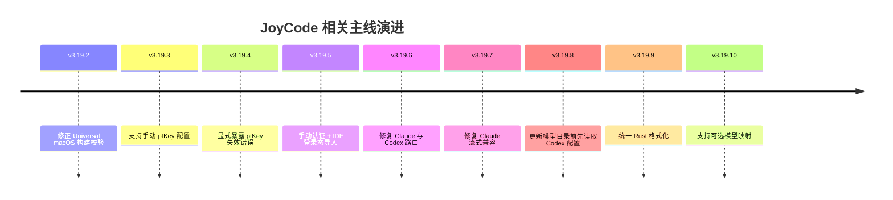
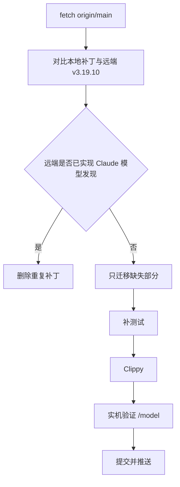

# CC Switch 改动历史与项目概况

> 目的：给后续任务一个“先看代码前先看这里”的入口，避免重复踩坑。
> 基准：本地仓库当前以 `v3.19.5` 为主线，远端 `origin/main` 已推进到 `v3.19.10`。
> 说明：本文只记录结构与事实，不包含任何密钥、`ptKey`、账号信息或请求正文。

## 1. 项目一句话概括

CC Switch 是一个多客户端供应商切换与本地代理工具，JoyCode 是其中最复杂的供应商之一：
它不是普通 OpenAI-compatible 服务，而是“专用认证 + 内外网网关 + 动态模型目录 + 每模型协议路由 + 会话续接 + 流式响应转换”的组合。

## 2. 当前仓库状态

| 项 | 当前值 |
| --- | --- |
| 本地分支 | `codex/docs-change-logs` |
| 基准提交 | `347ccc84` (`v3.19.5`) |
| 远端 main | `81255052` (`v3.19.10`) |
| 本地未提交补丁 | 3 个文件，约 208 行新增，主题是 Claude Code 模型发现 |
| 目标 | 补齐 Claude `/model` 完整模型列表，并避免与其他客户端模型发现冲突 |

### 2.1 本地未提交补丁范围

当前工作区保留了未提交的 JoyCode + Claude Code 改动：

```text
src-tauri/src/proxy/handlers.rs
src-tauri/src/proxy/server.rs
src-tauri/src/services/proxy.rs
```

核心内容：

1. 新增 `GET /claude/v1/models`
2. JoyCode Claude 接管时使用独立 `/claude` 命名空间
3. 注入 `CLAUDE_CODE_ENABLE_GATEWAY_MODEL_DISCOVERY=1`
4. Claude 响应转换改用本次模型实际 `wire_api`
5. 非 JoyCode 供应商保持原行为不变

这份补丁尚未完成实机 UI 验证，也尚未提交。

## 3. 版本时间线



## 4. 已完成的主要能力

### 4.1 全应用 JD Joycode 预设

覆盖客户端：

- Claude
- Claude Desktop
- Codex
- Gemini
- Grok Build
- OpenCode
- OpenClaw
- Hermes
- Pi

关键点：

- 所有客户端都增加 `JD Joycode` 预设
- 不允许直连 JoyCode
- 必须经过 CC Switch 本地代理
- 内网/外网地址由枚举选择
- 供应商表单隐藏自由地址输入

### 4.2 认证

JoyCode 认证不是普通 Bearer Token，而是：

```text
ptKey
+ loginType
+ tenant
+ 外网签名
+ 客户端版本
+ 请求 UUID
```

已实现两条认证路径：

1. **手动配置**
   - 支持直接填写 `BJ.*`
   - 支持 `ptKey=...`
   - 支持 `pt_key=...`
   - 保存后通过 `userInfo` 校验

2. **一键导入 JoyCode IDE 登录态**
   - 读取新版 `JoyCode.joycoder-editor/jdhLoginInfo`
   - 保留 `ptKey`
   - 保留 `loginType`
   - 保留 `tenant`
   - 导入后先调用 `userInfo`
   - 校验成功后自动获取模型列表

关键结论：

- `PIN_JD_CLOUD` 已支持
- 旧逻辑只按 `BJ.*` 推断 `ERP`，这是历史 401 根因
- 官网普通 Cookie 不能当作 API 凭据
- 官方网页登录回调给 IDE，不是给 CC Switch

### 4.3 模型目录

已实现：

- 调用 JoyCode 专用 `modelList`
- 解析真实模型 ID
- 解析上下文窗口
- 解析输出 token 上限
- 解析 `adapterType`
- 目录缓存 30 分钟
- 为各客户端暴露模型列表接口

典型目录规模：

- 19 个模型
- Chat 模型 14 个
- Responses 模型 1 个
- Anthropic 模型 4 个

### 4.4 动态协议路由

JoyCode 不按供应商统一协议，而是按模型路由：

| `adapterType` | 内部协议 | 上游端点 |
| --- | --- | --- |
| `anthropic` | Anthropic Messages | `/api/saas/anthropic/v1/messages` |
| `openai-response` | OpenAI Responses | `/api/saas/openai/v1/responses` |
| 其他 / 默认 | OpenAI Chat Completions | `/api/saas/openai/v2/chat/completions` |

关键原则：

```text
模型解析结果 = model_id + wire_api + token limits
```

请求转换、端点选择、响应转换必须使用同一份解析结果，不能混用供应商静态 `apiFormat`。

### 4.5 会话保持与缓存

已实现或预留：

- Responses
  - `store + previous_response_id`
  - 6 小时本地响应链
  - 最多 256 个会话
  - 失效后完整重放一次
- Chat
  - 尝试注入稳定 `prompt_cache_key`
  - 服务端不支持时自动降级
- Anthropic
  - 使用缓存断点思路

边界：

- `previous_response_id` 只表示状态续接
- 不能证明 prompt cache 命中
- 是否省钱必须看 usage 中的 cached token 指标
- 多轮缓存命中、图片/大文件预算尚未完全闭环

## 5. 关键代码入口

| 主题 | 文件 |
| --- | --- |
| JoyCode 协议内核 | `src-tauri/src/proxy/providers/joycode.rs` |
| 代理路由与响应处理 | `src-tauri/src/proxy/handlers.rs` |
| 上游转发与协议解析 | `src-tauri/src/proxy/forwarder.rs` |
| 本地代理服务器 | `src-tauri/src/proxy/server.rs` |
| Claude 接管配置 | `src-tauri/src/services/proxy.rs` |
| 供应商模型目录命令 | `src-tauri/src/commands/model_fetch.rs` |
| 前端 JoyCode 表单 | `src/components/providers/forms/JoycodeConnectionFields.tsx` |
| 前端供应商预设 | `src/config/*ProviderPresets.ts` |
| 技术设计文档 | `docs/joycode-provider-technical-design-zh.md` |
| 逆向评审文档 | `docs/joycode-provider-review-2026-08-20-zh.md` |

## 6. 发布与 CI 状态

已处理：

- macOS 无 Apple 证书构建
- Universal binary 校验
- Release artifact 上传
- CI Clippy `-D warnings`
- 旧标签使用旧 workflow 的问题
- Release 矩阵收敛为仅 macOS

当前远端最新：

```text
origin/main = 81255052
tag = v3.19.10
```

本地主线仍停在：

```text
347ccc84 = v3.19.5
```

后续任务开始前应先：

```bash
git fetch origin
git rebase origin/main
```

## 7. 遗留问题

1. **Claude Code `/model` 不展示完整 JoyCode 模型**
   - 编辑页能拿到目录
   - Claude Code 只看到少量重复 `joycode`
   - 需要接入 gateway model discovery
2. **本地补丁未实机验证**
   - 静态测试通过
   - Clippy 通过
   - 但尚未确认 `/model` UI 真实展示
3. **远端 main 已继续演进**
   - 本地补丁基于 `v3.19.5`
   - 需要基于 `v3.19.10` 重新评估
4. **协议映射仍需复核**
   - `origin/main` 已有后续路由与流式修复
   - 不能直接覆盖或重复实现
5. **多轮缓存、图片、大文件预算尚未完全闭环**
   - 不应宣称“缓存已命中”
   - 需要看 usage 指标

## 8. 推荐接手顺序



## 9. 常用验证命令

```bash
cargo fmt --check
cargo clippy --manifest-path src-tauri/Cargo.toml -- -D warnings
cargo test --manifest-path src-tauri/Cargo.toml joycode -- --nocapture
```

若涉及前端：

```bash
pnpm test
```

## 10. 备注

- 本文档不包含密钥、`ptKey`、账号信息或请求正文。
- 所有认证相关字段只记录名称，不记录值。
- 后续新增重要改动时，应同步更新本文，保持“项目概况 + 变更历史 + 遗留问题”三段结构。
