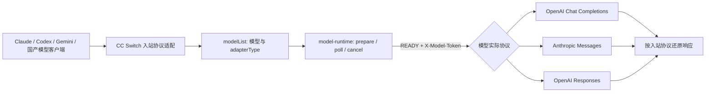
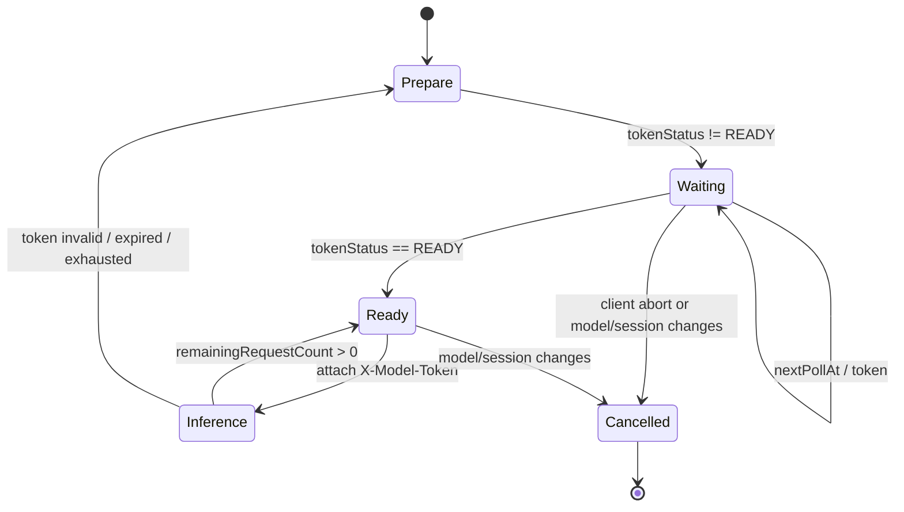

# JoyCode 供应商逆向分析与现有实现评审

> 审计日期：2026-08-20（Asia/Shanghai）<br>
> 审计对象：CC Switch `v3.19.5`（`main@347ccc84`）、本机 JoyCode `3.0.10`、`joycoder-editor 3.8.67`<br>
> 性质：逆向分析、代码评审、修复实现与最小真实链路验收。第 1 节保留修复前结论用于根因追溯，第 0 节是当前状态。

## 0. 修复与验收结果（当前状态）

本轮已经关闭导致 Claude/Codex 不可用的两个 P0 问题，并完成真实外网流式调用：

| 项目 | 当前结果 |
| --- | --- |
| Claude 动态协议响应 | 已改为以本次模型目录解析出的实际协议决定响应转换；Anthropic 原生响应不再误进 OpenAI Chat 转换器 |
| Codex 默认协议 | 当客户端模型为 `joycode`/`custom` 别名时，Codex 优先选择 Responses 模型；Claude 优先选择 Anthropic 模型 |
| model-runtime | 已实现 prepare/轮询、READY/bypass、按账号/网络/模型/chatId singleflight 缓存、额度递减、过期失效和一次重新排队 |
| 推理认证 | READY 时注入 `X-Model-Token`，令牌加入日志脱敏集合且只保存在内存；官方 bypass 时不伪造令牌 |
| 2xx 业务错误 | 已识别 JSON/SSE 中的 `MODEL_TOKEN_*`，包括 gzip 压缩的 JSON 成功外壳，并触发一次失效重试 |
| 地址安全 | 外网/内网基址改为解析后的 scheme、host、port、path 白名单；JoyCode 推理走不自动重定向的原始转发路径 |
| 真实协议验收 | 使用本机有效登录态分别完成一次 Anthropic 和 Responses 的最小流式推理；正文与凭据不写测试输出，测试后有令牌时调用 cancel |
| 路由要求 | **必须开启。** JoyCode 的签名认证、动态模型协议、model-runtime 令牌、响应转换和会话缓存都在 CC Switch 本地路由中执行 |

当前结论是：Claude 与 Codex 的核心文本流式链路已经可用并有真实调用证据。工具调用、多轮缓存命中、大图片/文件预算仍属于扩展验收范围，不能由这次最小 smoke test 外推为全部通过。

## 1. 修复前结论（根因追溯）

现有 JoyCode 扩展已经完成了供应商识别、凭据导入、内外网地址、外网签名、动态模型目录、三种上游协议路由、请求转换、Responses 会话链和部分缓存标记，不能算“空实现”。但按当前 JoyCode 客户端协议，它还不是可稳定使用的完整实现。

Claude 当前失败有两个彼此独立的高优先级原因：

1. **缺少模型排队令牌链路。** 官方客户端会先调用 model-runtime `prepare`，轮询到 `READY` 后，把返回令牌放入推理请求的 `X-Model-Token`。当前 CC Switch 没有这三个 model-runtime 端点、没有令牌状态机，也从未发送该请求头。凭据和模型目录即使正常，推理请求仍可能收到 `MODEL_TOKEN_MISSING`、`MODEL_TOKEN_NOT_READY` 或 `MODEL_TOKEN_EXPIRED`。
2. **Claude 响应转换决策使用了静态配置，而不是本次模型的实际协议。** `forwarder` 已经能把 Claude 模型解析为 Anthropic 协议，但 `handlers.rs` 仍用供应商表单中持久化的 `apiFormat` 判断是否转换。本机 JoyCode 配置的静态值为 `openai_responses`，当前 Claude 模型实际为 `anthropic`；结果是原生 Anthropic SSE 可能被送进 OpenAI Chat SSE 转换器。

本机现有外网凭据已通过 `userInfo` 和 `modelList` 的只读校验，外网签名也有效；因此“仅仅重新导入 ptKey”不足以解释或修复上述两处协议问题。由于本机 CC Switch 日志和请求表中没有保留这次 Claude 失败的请求，本轮没有把某一个错误码冒充成已现场复现的根因。

## 2. 证据与置信度

| 结论 | 证据 | 置信度 |
| --- | --- | --- |
| 外网 ptKey、loginType、tenant 和签名链可用 | 只读调用 `userInfo`、`modelList` 均返回业务成功；不记录凭据值 | 已实测 |
| 当前目录同时存在 Chat、Responses、Anthropic 模型 | 模型目录共 19 项：Chat 14、Responses 1、Anthropic 4 | 已实测，目录会随服务端变化 |
| 官方客户端要求模型运行时令牌 | 安装包含 prepare/runtime/cancel 端点、READY 轮询、额度计数和 `X-Model-Token` 注入 | 静态代码确认 |
| CC Switch 修复前未实现运行时令牌 | 原始版本全仓库无 model-runtime、`MODEL_TOKEN_*` 或 `X-Model-Token` 实现 | 修复前源码确认；当前已关闭 |
| Claude 原生响应修复前可能被误转换 | 实际协议由模型目录动态返回，原响应层转换开关仍取静态 provider 配置 | 修复前源码确认；当前已关闭 |
| 修复后的 Claude/Codex 最小流式调用 | Anthropic 与 Responses 各一次真实外网调用通过 | 已实测 |

逆向样本：

- `/Applications/JoyCode.app`：产品版本 `3.0.10`。
- `joycoder-editor/dist/extension.js`：客户端版本 `3.8.67`，SHA-256 为 `df3825ccb334fd4740e74645a1db773b623d6acc7dfd9452aa8e3a4cd9c280c5`。
- 样本常量显示图片长边上限为 `2000px`。该数值是 JoyCode 客户端行为，不应外推成所有 OpenAI/Anthropic 服务的统一限制。

这里只记录互操作所需的端点、字段和状态机，不复制或发布大段闭源源代码、用户凭据或签名密钥。

## 3. 逆向得到的 JoyCode 架构



关键原则是：**客户端入站协议、模型实际协议和供应商表单中的默认协议是三个不同概念。** 路由与响应转换必须以本次 `modelList` 解析出的实际协议为准。

## 4. 内网与外网认证

### 4.1 共同认证上下文

当前官方客户端和 CC Switch 已确认使用：

- `ptKey`：用户凭据；必须脱敏，不写普通日志。
- `loginType`：例如 `PIN_JD_CLOUD`、`N_PIN_PC`、`ERP`，不能仅依赖 ptKey 前缀永久猜测。
- `tenant`：租户上下文。
- `x-ms-client-request-id`：每次请求的 UUID。
- `client=JoyCodeIDE`、`clientVersion=3.8.67`：请求体或协议上下文。

官方推理请求还会携带 `orgFullName`、`userId`、`language` 等上下文字段。它们是否是所有模型的强制字段需要通过最小化契约测试确认，不能因为当前目录接口不要求就直接删除。

### 4.2 内网

内网基址：`http://joycode-api-saas.jd.com`。端点直接使用 `/api/saas/...` 路径，不走彩色网关签名。

内网 HTTP 没有传输层加密，只应在可信企业网络或由企业网络层保护的环境使用；应用应明确提示，不应自动从“HTTP”推断用户一定在安全内网。

### 4.3 外网

当前外网基址：`https://api-ai.jd.com`。请求形式为：

```text
/api?appid=joycode_ide&functionId=<功能名>&t=<毫秒时间戳>&sign=<HMAC-SHA256>
```

签名消息为 `joycode_ide&functionId&timestamp`。签名材料随客户端分发，它更接近网关路由/完整性参数，不是用户身份的安全边界；真正的用户授权仍由 ptKey、loginType、tenant 和服务端策略决定。

### 4.4 安全缺口与修复状态

修复前 `provider_base_url` 和本机凭据发现校验只检查 `https://`/`http://` 前缀，随后会向该地址发送 ptKey。当前已加入精确 JD 主机、scheme、port、无 path/query/fragment/userinfo 的白名单，并让推理请求使用不跟随重定向的转发路径。以下要求继续作为安全基线，其中目录、userInfo 与 model-runtime 的专用禁止重定向客户端仍建议补齐：

- 解析 URL 后校验 scheme、host、port，不做字符串前缀校验。
- 默认只允许明确的 JD 域名；自定义地址需要单独的高级开关和醒目确认。
- 禁止跨主机重定向携带 ptKey；最好关闭自动重定向后自行验证 `Location`。
- 日志、错误体、请求追踪和崩溃报告统一做 ptKey、模型令牌和签名参数脱敏。

## 5. 模型目录与三协议适配

模型协议不能根据名字猜测。当前目录通过 `extJson.adapterType` 映射：

| `adapterType` | 实际上游协议 | 内网端点 | 外网 `functionId` |
| --- | --- | --- | --- |
| `openai-response` | OpenAI Responses | `/api/saas/openai/v1/responses` | `responses_completions` |
| `anthropic` | Anthropic Messages | `/api/saas/anthropic/v1/messages` | `anthropic_completions` |
| 其他/Chat | OpenAI Chat Completions | `/api/saas/openai/v2/chat/completions` | `chat_completions` |

模型记录中的 `maxTotalTokens`、`respMaxTokens` 应作为请求预算上限。目录缓存必须按 `network + account fingerprint` 隔离；协议、能力和限额都需要随目录刷新，不能只缓存模型名称。

### 5.1 OpenAI `/v1/chat/completions`

请求核心是 `messages`、`tools`、`tool_choice`、`stream` 和输出上限。适配时需要：

- Anthropic `system` 合并到 Chat 的 system/developer 消息，但保留消息顺序和工具语义。
- `tool_use`/`tool_result` 与 `tool_calls`/`tool` 成对转换，并保持调用 ID。
- SSE 以 `data:` 帧和 `[DONE]` 结束；要测试 UTF-8、JSON、工具参数跨 chunk 分裂。
- Chat 没有跨厂商统一的 PDF/document 内容块。当前实现选择显式拒绝而不是把 base64 当文本计 token，这一方向正确。

### 5.2 Anthropic `/v1/messages`

请求核心是顶层 `system`、`messages` 内容块、`tools`、`max_tokens` 和 `stream`。适配时需要：

- 保留 `text`、`image`、`document`、`tool_use`、`tool_result` 内容块。
- SSE 原生事件包括 `message_start`、`content_block_*`、`message_delta`、`message_stop`；原生 Anthropic 流应透传或仅做 JoyCode 外层解包，不能送入 OpenAI Chat chunk 转换器。
- `cache_control` 应放在稳定前缀末端，并从 usage 中读取 cache write/read token 验证是否命中。

### 5.3 OpenAI `/v1/responses`

请求核心是 `input`、`instructions`、`tools`、`store`、`previous_response_id` 和 `stream`。适配时需要：

- 保留 Responses item 的类型和 `call_id`，不能把所有内容压成普通消息文本。
- 使用 `store=true` 与 `previous_response_id` 做多轮状态续接；链失效时清理本地映射并完整重放一次。
- JoyCode 外网可能把 SSE 再包一层 `data:`，当前专用 normalizer 的方向正确。
- `previous_response_id` 是会话状态续接，不等同于“已经命中 prompt cache”；缓存必须看 usage 的 cached-token 指标。

## 6. 模型运行时令牌状态机

官方客户端包含以下端点：

| 操作 | 内网路径 | 外网 `functionId` |
| --- | --- | --- |
| 申请/轮询 | `/api/saas/model-runtime/v1/models/prepare` | `model_runtime_prepare` |
| 运行时快照 | `/api/saas/model-runtime/v1/models/runtime` | `model_runtime_snapshot` |
| 取消令牌 | `/api/saas/model-runtime/v1/models/cancel` | `model_runtime_cancel` |

第一次 prepare 的最小载荷为：

```json
{
  "model": "<model id>",
  "chatId": "<stable conversation id>",
  "stream": true,
  "client": "JoyCodeIDE",
  "clientVersion": "3.8.67",
  "language": "<language or UNKNOWN>",
  "orgFullName": "<account org>"
}
```

后续轮询向同一个 prepare 操作发送 `{ "token": "..." }`。返回状态至少包含 `tokenStatus`、`expireAt`、`nextPollAt`、`queuePosition`、`queueLimit`、`estimatedReadyAt`、`remainingRequestCount`。状态为 `READY` 后才发送模型请求：

```text
X-Model-Token: <ready token>
```

当前已按下图实现进程内运行时令牌管理：



实现约束：

- 缓存键至少是 `network + account fingerprint + model + chatId`。
- 同一键使用 singleflight/互斥，避免并发请求重复排队或重复消耗额度。
- `remainingRequestCount` 原子递减；为零、过期或 token 不匹配时重新 prepare。
- 令牌只放内存，不写配置、数据库或普通日志。
- 按服务端 `nextPollAt` 轮询，设置最大等待时间，并把排队进度反馈给调用端。
- 映射 `MODEL_QUEUE_FULL`、`MODEL_TOKEN_INVALID/MISSING/EXPIRED/CHAT_MISSING`、`MODEL_TOKEN_NOT_READY`、`MODEL_SESSION_PREPARE_CONFLICT` 和 401。
- 只有服务端明确返回 bypass 令牌/状态时才绕过排队；不要自行伪造或无限重试。
- 客户端取消、切模型或切会话时调用 cancel。

当前核心 prepare/轮询/READY/bypass/额度/过期/一次恢复已完成。cancel 端点和 live 测试清理已实现；把客户端 abort、切模型、切会话完整接入 cancel，以及把排队进度反馈给 UI，仍是后续生命周期完善项。

## 7. 多次请求的输入 token 缓存

需要区分四层机制，不能都称为“缓存”：

| 层 | 机制 | 当前状态 | 建议 |
| --- | --- | --- | --- |
| Anthropic | `cache_control` 前缀缓存 | 已有通用注入器 | 与 JoyCode 实际支持的断点位置做契约测试，记录 cache write/read tokens |
| OpenAI Chat | `prompt_cache_key`/稳定前缀 | 已尝试注入，400 后降级 | 以能力探测和 usage 为准；不能因没有 400 就宣称命中 |
| Responses | `store + previous_response_id` | 已实现 6 小时本地链与 400 全量回放 | 保留；明确它是状态续接，不是缓存命中证明 |
| 客户端上下文 | 内容寻址、历史压缩、文件复用 | 基本缺失 | 增加内容摘要、附件哈希、去重和 token 预算器 |

统一缓存键建议：

```text
sha256(provider + network + account + model + wire_api + tools_digest
       + system_digest + stable_prefix_digest + safety/config version)
```

稳定内容放在前面：工具定义、系统指令、仓库规则、长期上下文；时间戳、当前用户消息、动态检索结果放在后面。任何协议转换都必须保证稳定前缀序列化稳定，否则内容相同但 JSON 顺序/空字段变化也会破坏缓存路由。

观测至少记录：`input_tokens`、`cached_tokens`/`cache_read_input_tokens`、`cache_creation_input_tokens`、请求体摘要、模型实际协议、是否使用 response chain。只记录摘要和计数，不记录敏感正文。

## 8. 多模态大文件与图片 token 优化

官方 JoyCode 客户端已出现以下策略：

- 图片长边超过 `2000px` 时等比缩小。
- Anthropic 历史只保留最近 10 张图片，较老图片替换为明确的省略文本。
- 根据最近用户轮次是否有图片选择多模态路由；模型不支持图片时过滤或给出明确错误。

当前 CC Switch 主要做协议形状转换和 Chat 文档拒绝，没有统一的图片尺寸、像素、字节数、数量、历史预算和附件去重层。

推荐增加 `JoycodeContentBudgeter`，在模型协议确定后、序列化前执行：

1. **能力检查**：从目录能力字段或经过验证的 capability registry 判断 image/document 支持；未知默认 fail closed。
2. **图片规范化**：验证 MIME 与真实文件头，修正 EXIF 方向，去除非必要元数据；以协议/模型 profile 决定上限。JoyCode 兼容 profile 可先用长边 `2000px`。
3. **按用途选质量**：普通场景降低分辨率和 OpenAI `detail`；OCR、代码截图、表格保留足够清晰度。不能一律压低导致语义丢失。
4. **内容寻址去重**：用原始内容 SHA-256 标识附件，同一会话不重复解码、缩放和上传。
5. **历史裁剪**：优先保留当前轮和最近相关图片；旧图片替换成包含哈希/摘要的明确占位，不静默删除。
6. **大文件**：若上游明确支持 Files API/file URL，上传一次后复用 ID；JoyCode 当前未逆向确认独立 Files API，不能虚构。否则本地抽取文本、分块、检索相关片段，并保留页码/偏移以便引用。
7. **硬预算**：序列化前估算文本 token、图片像素成本、附件字节和输出上限；超过预算时给用户可解释的降级或拒绝。

OpenAI 官方支持 URL、base64 data URL、file ID 等图像输入方式，并提供 `detail` 控制；Anthropic 官方支持 base64/URL 图像，并建议超大图片在上传前缩放。具体上限会随模型变化，运行时应采用协议 profile，而不是一个全局常量。

## 9. 现有实现评审

### 9.1 已完成且方向正确

- 以 `providerType=joycode` 识别供应商，不靠名称猜测。
- 内外网端点和外网 HMAC 签名已实现，并经目录接口实测。
- 从 JoyCode/VS Code/JetBrains 本地存储只读发现凭据，且会调用 userInfo 校验。
- 模型目录按 `adapterType` 选择 Chat、Anthropic、Responses，而不是按模型名猜测。
- Claude、Codex、Gemini 等入站请求已有跨协议转换骨架。
- Responses 双层 SSE 解包、response chain 与失效全量重放已有实现。
- Anthropic 有 `cache_control` 注入，Chat 的可选 `prompt_cache_key` 会在 400 后降级。
- Chat 遇到 document/input_file 会明确拒绝，避免把 base64 静默转成高成本文本。

### 9.2 修复前 P0/P1 缺陷与当前状态

#### A. 缺少 model-runtime 令牌

位置：`src-tauri/src/proxy/providers/joycode.rs` 的端点与认证头、`src-tauri/src/proxy/forwarder.rs` 的 JoyCode 请求发送路径。

**已关闭核心缺陷。** 解析模型后、构造推理请求前会获取运行时令牌，READY 时注入 `X-Model-Token`；2xx JSON/SSE 与 gzip JSON 中的模型队列错误会触发失效和一次重排队。客户端 abort/切换时的主动 cancel 仍待补齐。

#### B. Claude 动态协议响应被静态配置误导

位置：`src-tauri/src/proxy/handlers.rs:281-305` 与 `:476-503`。

**已关闭。** `needs_transform` 现在优先使用 `ForwardResult` 的实际协议，以 `claude_api_format_needs_transform(actual_wire_format)` 决定；实际协议为 `anthropic` 时原生透传。

#### C. 任意外网地址可能接收 ptKey

位置：`src-tauri/src/proxy/providers/joycode.rs:616-633`、`:886-907`。

**部分关闭。** 已改为 JD 主机和 URL 组成白名单，推理路径不跟随重定向。目录、userInfo、model-runtime 使用的通用 HTTP 客户端仍应增加专用 no-redirect 策略。

#### D. 缺少多模态预算层

现有代码只解决“格式能否转换”，没有解决“图片/文件是否值得重复发送、是否超过像素/字节/token 预算”。长会话会反复携带 base64 图片，输入成本和延迟都会放大。

### 9.3 P2 优化

- `clientVersion` 硬编码为 `3.8.67`，JoyCode 更新后会漂移。应从已安装扩展安全探测，失败再用经过验证的默认值，并在兼容测试后更新。
- 模型目录只解析路由和 token 上限，未形成显式 image/document/tool/reasoning 能力矩阵。
- 30 分钟目录缓存期间若服务端改变 `adapterType`，旧协议仍会继续使用；业务协议错误时应强制刷新一次目录。
- 缓存只有注入与降级，没有可见的命中率、节省 token、链失效率统计。
- 需要 JoyCode 专用 SSE 外层解包的统一测试矩阵，特别是 Anthropic 原生流和 2xx 业务错误帧。

## 10. 后续实施顺序

1. 为 userInfo、modelList、model-runtime 增加 JoyCode 专用 no-redirect HTTP 客户端。
2. 把客户端 abort、切模型、切会话接入 cancel，并向 UI 返回排队进度。
3. 增加内容预算器，先落图片长边、字节数、数量、历史 10 张和 SHA-256 去重，再做文件检索/上传能力。
4. 完善缓存观测与 capability registry，用 usage 证明命中，而不是从请求字段推断。
5. 扩展工具调用、两轮 response chain、缓存 usage、大图与文件的 live 验收矩阵。

## 11. 测试与验收

### 11.1 单元/契约测试

- 三种 `adapterType` 的请求与响应路由。
- Claude provider 静态格式为 Responses、实际模型为 Anthropic 时必须原生透传。
- Chat/Responses/Anthropic 的 SSE 事件被任意拆 chunk、CRLF/LF、UTF-8 跨 chunk 时仍正确。
- model-runtime：立即 READY、排队后 READY、过期、额度耗尽、token 不匹配、取消、切模型、并发 singleflight。
- `MODEL_TOKEN_*` 出现在非 2xx JSON、2xx JSON、SSE error 帧三种情况。
- 自定义恶意 host、跨 host 重定向均不得携带 ptKey。
- 3000px 图片被缩至 profile 上限；最近图片保留，历史图片有明确占位；相同附件只处理一次。
- 日志快照不得含 ptKey、模型 token、签名或正文附件。

### 11.2 live smoke test 状态

每种实际协议选择一个模型，做最小两轮请求：

1. modelList 解析实际协议。
2. prepare 直到 READY，并验证 `remainingRequestCount`。
3. 带 `X-Model-Token` 发第一轮流式文本。
4. 第二轮验证工具调用、会话续接和缓存 usage。
5. Claude 原生 Anthropic SSE 不经 Chat 转换。
6. 发一张超过 2000px 的测试图，确认客户端缩放后仍能回答且请求体不重复增长。

本轮已获得处理和可用性验证授权，并完成步骤 1、2、3 的最小化变体：Anthropic 与 Responses 各选一个当前模型，执行运行时 prepare/官方 bypass、流式文本推理和可用令牌 cancel。两条调用均成功，且测试不输出凭据或模型正文。

步骤 4 的第二轮工具/会话/缓存 usage 和步骤 6 的大图测试尚未执行；因此只能确认 Claude/Codex 核心文本流式链路，不能宣称全部工具、多轮缓存和多模态场景已经完成 live 验收。

## 12. 验证记录与限制

- Rust `cargo check` 与 `cargo clippy --lib -- -D warnings` 通过。
- JoyCode 定向测试 22 通过、1 个 live 测试默认 ignored；Claude 动态协议测试通过；显式执行 live 测试通过。
- Rust 全量库测试为 2698 通过、1 失败、6 ignored；唯一失败是本机正在运行的 CC Switch 占用测试固定端口 `127.0.0.1:15721`，没有为测试关闭用户进程。
- 前端 `providerCapabilities` 22 项通过，`tsc --noEmit` 与 Vite production build 通过。
- 未完成工具调用、完整多轮缓存 usage 和多模态 live 验收。

## 13. 官方协议参考

- OpenAI Chat Completions：<https://developers.openai.com/api/reference/resources/chat/subresources/completions/methods/create>
- OpenAI prompt caching：<https://developers.openai.com/api/docs/guides/prompt-caching>
- OpenAI images and vision：<https://developers.openai.com/api/docs/guides/images-vision>
- Anthropic Messages：<https://platform.claude.com/docs/en/api/messages>
- Anthropic prompt caching：<https://platform.claude.com/docs/en/build-with-claude/prompt-caching>
- Anthropic vision：<https://docs.anthropic.com/zh-CN/docs/build-with-claude/vision>

这些官方文档用于校准标准协议；JoyCode 特有的端点、签名、排队令牌和 2000px 策略来自上述本机安装样本，二者不能混为一谈。
