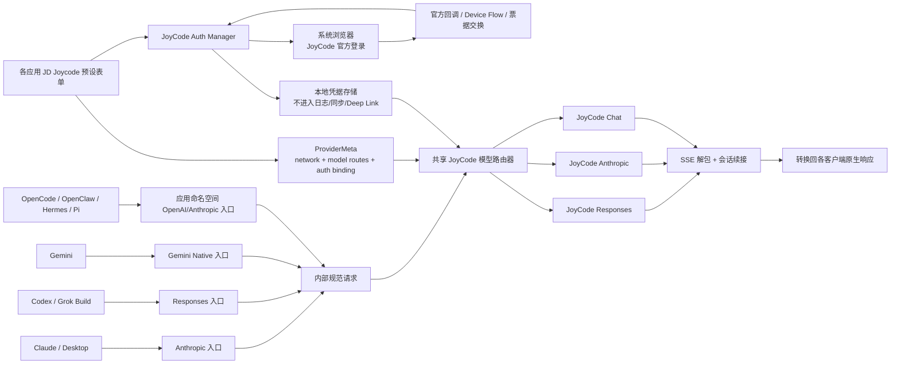
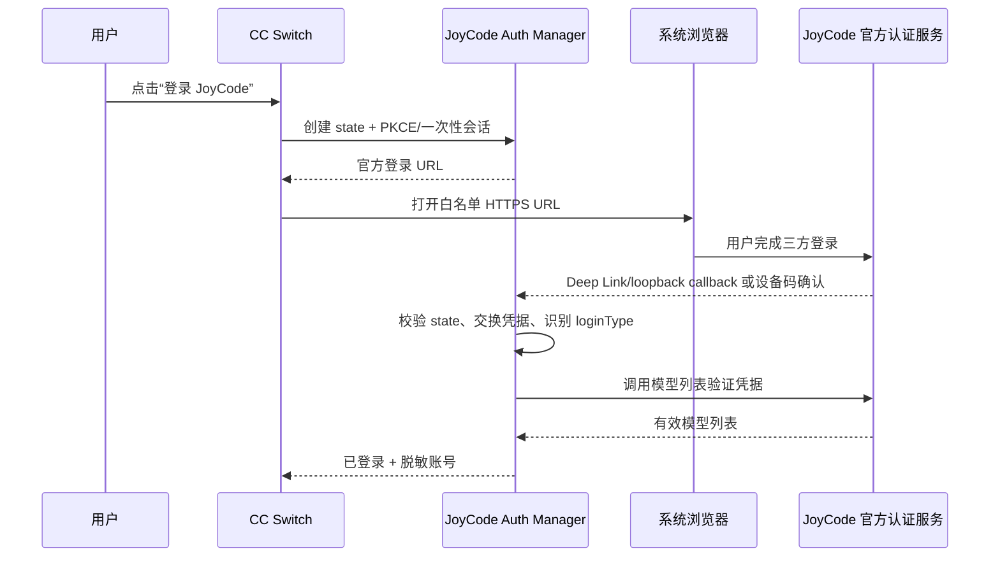
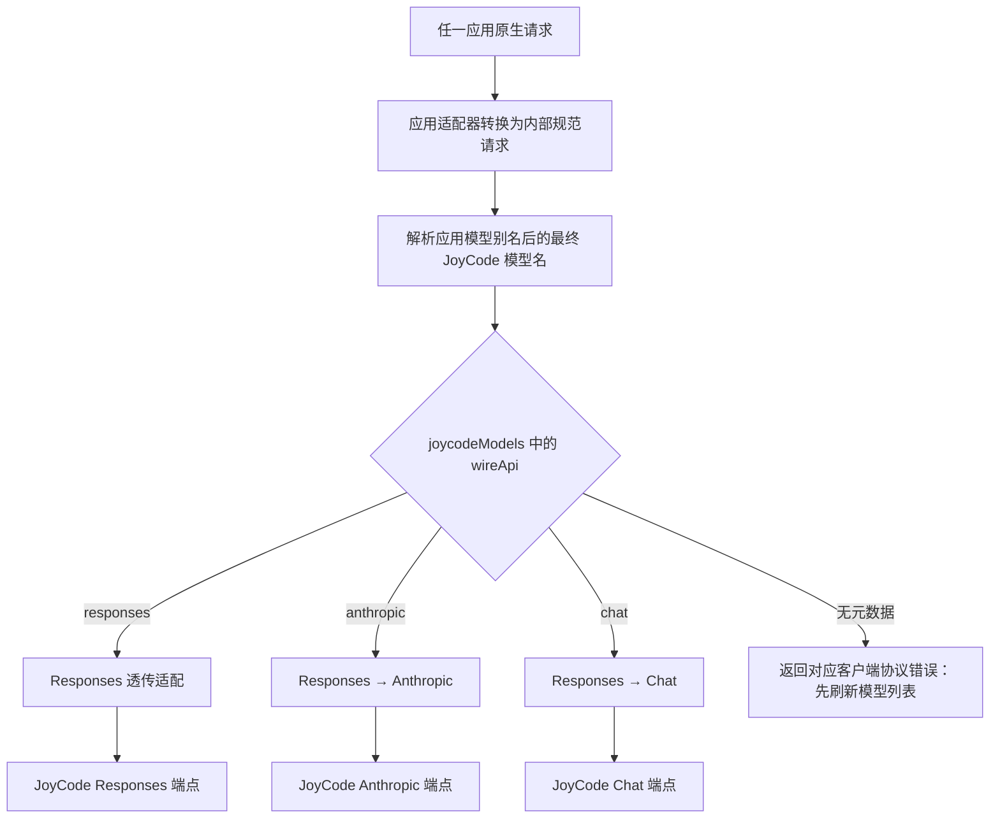
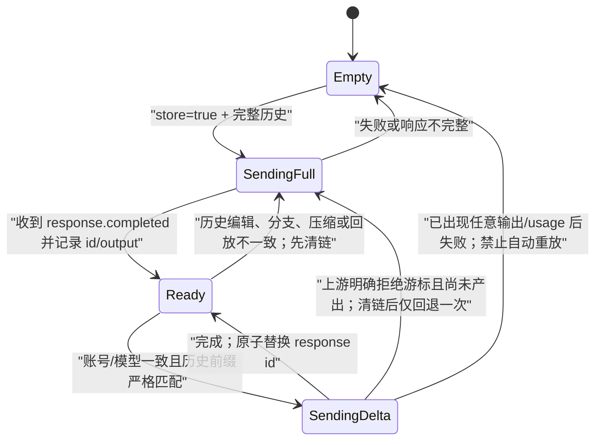
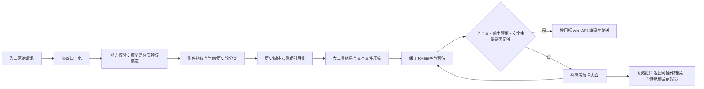

# JD JoyCode 全应用供应商需求与技术实现方案

> **2026-08-20 修复验收提示：** 本文是首版设计基线；JoyCode `3.0.10` 的 model-runtime 排队令牌、Claude 动态协议响应和 Codex Responses 默认路由已经补齐，并完成 Anthropic/Responses 最小真实流式调用。请以 [JoyCode 供应商逆向分析、修复与验收记录](./joycode-provider-review-2026-08-20-zh.md) 的当前状态为准。

> 状态：已完成可验证协议实现；外网域名与官方 OAuth 回调仍等待协议确认
> 目标应用：CC Switch 全部供应商应用（Claude、Claude Desktop、Codex、Gemini、Grok Build、OpenCode、OpenClaw、Hermes、Pi）
> 编写日期：2026-08-17
> 参考实现：本机 `CodexPlusPlus` 仓库中的 JoyCode 协议实现
> 说明：需求截图只用于确认“添加新供应商”页面的交互位置，不作为接口地址、认证协议或模型能力的事实来源。

## 1. 结论先行

这不是“在 Codex 增加一条预设数据”即可完成的需求。JD JoyCode 同时具备专用认证头、专用模型列表、按模型动态选择三种上游协议、外网动态签名以及特殊 SSE 行为。要覆盖 CC Switch 全部应用，必须建设一层共享 JoyCode 兼容网关，再让九种应用按各自原生协议进入网关，不能让各应用直接请求 JoyCode。

| 需求 | 可行性 | 结论 |
| --- | --- | --- |
| 全部应用增加 `JD Joycode` 预设 | 可实现 | 九种应用都增加，类别为国内官方；预设结构按各应用原生配置分别生成 |
| 内网/外网地址直接选择 | 可实现，但缺参数 | UI 使用枚举，不显示自由输入框；外网 API 地址仍需确认 |
| 获取模型列表 | 可实现 | 需要新增 JoyCode 专用 POST 请求，不能复用当前通用 `GET /v1/models + Bearer` |
| 适配模型调用 | 可实现 | 必须根据模型元数据动态走 Responses、Anthropic Messages 或 Chat Completions |
| 会话保持与缓存降费 | 可实现，但需服务端契约验收 | Responses 使用响应链，Chat 使用稳定缓存键，Anthropic 使用缓存断点；不能混为一种机制，也不能用“已续接”代替真实 cached token 指标 |
| 图片、大文件与 token 优化 | 可实现，部分依赖附件 API | 当前轮内容保真，历史媒体去重/引用化，工具大结果压缩并预留输出预算；图片和文件主要属于输入成本，不应误称为输出 token |
| 打开官网登录并自动取得凭据 | 当前不实现 | 官网未提供可验证的第三方授权回调，普通浏览器登录后 CC Switch 无权读取浏览器 Cookie；当前版本改为手动填写 `ptKey` |
| 不经过 JoyCode 本地网关直接使用 | 不可行 | 各客户端都不会完整发送 JoyCode 所需的 `ptKey`、`loginType`、签名 URL 和客户端字段 |

当前实现范围为“共享 JoyCode 协议内核”“九应用接入”和手动 `ptKey` 配置。网页登录自动导入不在当前范围，不能用抓取浏览器 Cookie 的方式代替官方授权协议。

## 2. 需求定义

### 2.1 功能范围

1. 在以下所有“添加新供应商 → 预设供应商”列表中增加 `JD Joycode`：
   - Claude；
   - Claude Desktop；
   - Codex；
   - Gemini；
   - Grok Build；
   - OpenCode；
   - OpenClaw；
   - Hermes；
   - Pi。
2. 选择预设后：
   - 供应商名称自动填充为 `JD Joycode`；
   - 隐藏通用 API 地址输入和地址管理器；
   - 显示“网络环境”单选项：`内网地址`、`外网地址`；
   - 地址由程序常量映射，用户不能手工修改。
3. 显示 JoyCode 登录区：
   - 未登录、登录中、已登录、凭据失效四种状态；
   - 点击“登录 JoyCode”后打开官方登录页；
   - 官方认证完成后自动保存可用于 API 调用的凭据；
   - 不在界面、日志、错误信息中展示完整凭据。
4. 使用当前登录凭据和网络环境获取 JoyCode 模型列表。
5. 把模型 ID、上下文窗口和上游适配类型写入供应商模型目录。
6. 各应用请求统一进入 CC Switch 的应用命名空间端点，由代理先转换为内部规范请求，再按模型动态转发到 JoyCode。
7. JoyCode 返回认证失效时，前端显示重新登录入口；如果响应含官方 `loginUrl`，只允许打开白名单域名。
8. 同一客户端会话的稳定前缀应尽量复用 JoyCode 服务端响应链或提示缓存；模型、账号、网络、应用或会话发生变化时必须隔离，不能为了缓存命中串用上下文。
9. 图片、音频、大文件和工具输出需要进入统一内容预算流程：保留当前轮必要内容，历史大媒体去重或引用化，大文本工具结果按明确规则压缩，并为模型输出预留 token 预算。

### 2.2 非目标

- 不允许用户手填第三个 JoyCode 地址。
- 不从 Chrome、Safari、Edge 等浏览器数据库或 Cookie Store 抓取登录态。
- 不把 JoyCode 固定签名材料、`ptKey` 或其他凭据写入日志、诊断包、Deep Link 或同步导出。
- 不假定所有 JoyCode 模型都兼容同一种 OpenAI API，也不假定九种应用可以共享同一份原生配置模板。

## 3. 参考实现核对结果

### 3.1 Codex++ 已实现的协议事实

参考文件：

- `apps/codex-plus-manager/src/presets.ts`
- `crates/codex-plus-core/src/model_catalog.rs`
- `crates/codex-plus-core/src/protocol_proxy.rs`
- `crates/codex-plus-core/src/relay_config.rs`

已确认行为：

1. 预设内网 API 地址为 `http://joycode-api-saas.jd.com`，官网地址为 `http://joycode.jd.com`。
2. 认证不是 Bearer Token，而是至少包含：
   - `ptKey`；
   - `loginType`：以 `BJ.` 开头的凭据使用 `ERP`，其他使用 `N_PIN_PC`；
   - `x-ms-client-request-id`：每次请求生成 UUID；
   - `client: JoyCodeIDE`；
   - `clientVersion`。
3. 模型列表使用 POST，请求体包含 `client` 和 `clientVersion`。
4. 模型 ID 来自 `data[].chatApiModel`。
5. 模型上游协议来自 `data[].extJson.adapterType`；旧响应也可能把 JSON 字符串放在 `data[].ext`：
   - `openai-response` → JoyCode Responses；
   - `anthropic` → JoyCode Anthropic Messages；
   - 其他或缺失 → JoyCode Chat Completions。
6. 内网使用固定路径，HTTPS 外网使用 `functionId + 时间戳 + 签名`形式的动态网关 URL。
7. JoyCode Responses SSE 可能在标准 `data:` 外再包一层 `data:`，需要流式解包。
8. Responses 模型启用服务端存储并使用响应 ID 续接后续轮次；Codex++ 为此维护会话状态和失败回退。
9. Codex++ 没有实现“打开普通官网后从浏览器自动取凭据”。它的自动凭据来源是：
   - JetBrains 配置中的 JoyCoder `userToken`；
   - VS Code/JoyCode `state.vscdb` 中 `JoyCoder.joycoder-fe.jdhLoginInfo.ptKey`；
   - 用户配置的回退值。
10. Codex++ 的 Responses 会话状态按“供应商/账号边界 + 模型 + 稳定会话 ID”隔离；只有当前完整历史能严格匹配已保存请求和响应前缀时，才改发增量输入与 `previous_response_id`。历史被编辑或回放不一致时清理链并发送完整历史。
11. Codex++ 同时观察流式 `response.completed` 和非流式完成响应以记录新的 response ID；参考实现使用 6 小时内存 TTL、最多 256 条会话，并在响应链被上游拒绝时回退一次完整请求。该容量和 TTL 是参考实现参数，不是已确认的 JoyCode 服务端契约。
12. Responses 转 Chat 时，Codex++ 会从历史消息中移除超过阈值的旧 base64 媒体，但保留最新一条消息中的媒体；这说明历史媒体重复发送确实需要治理，也说明“直接删除所有图片”会破坏当前轮语义。

### 3.2 现有参考实现不能直接证明的内容

- 外网 API Base URL：源码只通过 `https://` 判断使用签名网关，没有定义外网域名常量。
- 在官方地址确认前，实现仅允许部署方通过 `CC_SWITCH_JOYCODE_EXTERNAL_BASE_URL` 下发 HTTPS 地址；产品表单不提供自由输入框，也不猜测域名。
- 外网与内网是否使用同一登录页。
- 官网网页登录没有可供第三方桌面应用取得 `ptKey` 的已知回调，因此当前仅支持手动填写或显式扫描官方本机客户端存储。
- 固定签名材料能否由 CC Switch 合法复用、是否会轮换。
- `clientVersion` 是否必须跟随官方 JoyCode IDE 版本更新。

这些内容不能靠猜测写进实现。

### 3.3 CC Switch 当前能力与缺口

| 模块 | 当前能力 | JoyCode 缺口 |
| --- | --- | --- |
| `src/config/codexProviderPresets.ts` | 配置 Codex 预设、地址候选、API 格式和模型目录 | 缺 `joycode` 类型、网络枚举及专用认证声明 |
| `src/components/providers/forms/CodexFormFields.tsx` | API Key、自由 Base URL、通用模型获取、OAuth 账号选择 | 缺 JoyCode 网络选择和登录状态组件 |
| `src-tauri/src/services/model_fetch.rs` | `GET /models` 候选 + Bearer/x-api-key | JoyCode 要求 POST、专用头、专用响应解析和动态签名 |
| `src-tauri/src/provider.rs` | `ProviderMeta.apiFormat` 为供应商级单值 | JoyCode 是模型级协议，需保存模型 → 协议映射 |
| `src-tauri/src/proxy/providers/codex.rs` | 供应商级 Responses/Chat/Anthropic 路由 | 缺同一供应商内按模型动态路由 |
| `src-tauri/src/proxy/forwarder.rs` | 通用 URL、认证头、格式转换和请求覆写 | 缺 JoyCode 动态端点、动态头、body 字段、响应归一化 |
| `src-tauri/src/proxy/session.rs` | 已提取 Claude、Codex、Grok Build 稳定会话 ID；生成 UUID 不参与上游缓存 | 需覆盖其余应用，并形成包含账号、网络、模型和协议的 JoyCode 会话键 |
| `src-tauri/src/proxy/cache_injector.rs` | Anthropic 路径可注入 tools、system、最近消息等最多 4 个缓存断点 | 需限定在 JoyCode 支持的模型上，并用用量数据验证是否真实命中 |
| `src-tauri/src/proxy/tool_media.rs` / `media_sanitizer.rs` | 可识别工具输出媒体、抽离媒体并钳制媒体结果中的大 base64 残留 | 缺普通历史用户附件去重、文件引用生命周期和统一 token/字节预算 |
| Managed Auth | GitHub、Codex、xAI 的 Device Flow/账号管理 | 缺 JoyCode 官方认证协议和凭据管理器 |

### 3.4 全应用接入矩阵

CC Switch 共有九个 `AppId`。其中 Claude、Codex、Gemini、Grok Build 已被标记为完整本地代理应用；OpenCode、OpenClaw、Hermes、Pi 是原生配置累加模式；Claude Desktop 使用独立的本地 gateway。JoyCode 的全应用支持应按下表实施：

| 应用 | 客户端入口协议 | 当前代理基础 | JoyCode 接入方案 | 主要新增工作 |
| --- | --- | --- | --- | --- |
| Claude | Anthropic Messages | 完整 | `/claude/v1/messages` → 共享 JoyCode 内核 | 根据目标模型转换为 JoyCode Responses/Anthropic/Chat |
| Claude Desktop | Anthropic Messages | 独立 gateway | `/claude-desktop/v1/messages` → 共享内核 | 强制 `proxy` 模式，复用 Desktop 模型角色映射 |
| Codex | OpenAI Responses | 完整 | `/codex/v1/responses` → 共享内核 | 模型级三协议路由、Responses 会话与 SSE |
| Gemini | Gemini Native | 仅原生 Gemini 透传 | `/gemini/v1beta/*` → 共享内核 | **新增双向 Gemini Native ↔ 内部规范协议转换** |
| Grok Build | OpenAI Responses | 完整 | `/grokbuild/v1/responses` → 共享内核 | 与 Codex 共用路由，保留独立供应商命名空间 |
| OpenCode | 可选 OpenAI/Anthropic SDK | 无完整本地数据面 | `/opencode/v1/*` → 共享内核 | 新增命名空间路由，预设使用本地 OpenAI Compatible 地址 |
| OpenClaw | OpenAI Responses/Chat/Anthropic 等 | 无完整本地数据面 | `/openclaw/v1/*` → 共享内核 | 新增命名空间路由，锁定预设协议，禁止直连 |
| Hermes | Chat/Anthropic/Responses | 无完整本地数据面 | `/hermes/v1/*` → 共享内核 | 新增命名空间路由，生成 `custom_provider` 配置 |
| Pi | Chat/Responses/Anthropic/Gemini | 当前代理 adapter 不支持 Pi | `/pi/v1/*` → 共享内核 | 新增 Pi 命名空间与 adapter/路由选择 |

其中 Gemini 的协议转换是独立高风险工作项。当前 `handle_gemini` 只是把 Gemini 请求透传给 Gemini 上游，现有 `transform_gemini.rs` 主要服务其他客户端调用 Gemini 上游，不能反向证明 Gemini CLI 已能调用 OpenAI/Anthropic/JoyCode。必须新增请求与响应的双向转换及流式测试。

## 4. 推荐总体架构



### 4.1 为什么共享 JoyCode 网关是强制条件

JoyCode 需要在每次请求时动态执行以下动作：

- 用真实凭据生成 `ptKey` 和 `loginType`；
- 生成请求 UUID；
- 添加 JoyCode 客户端头和请求体字段；
- 根据当前模型选择三种不同的上游端点与协议转换；
- 外网请求按当前时间生成签名 URL；
- 处理 JoyCode 特殊 SSE 和认证错误。

任一客户端的原生配置都不能完整表达这些规则。因此：

- 供应商可以在 JoyCode 网关未启动时保存；
- 激活 Claude、Codex、Gemini、Grok Build 的 JoyCode 供应商时，如果对应应用路由接管未开启，应阻止切换并引导用户确认开启；
- Claude Desktop 的 JoyCode 预设固定使用 `proxy` 模式；
- OpenCode、OpenClaw、Hermes、Pi 的 JoyCode 预设必须写入应用专属本地网关地址，而不是 JoyCode 上游地址；这四个应用需要新增 namespaced gateway 数据面；
- 不建议静默改变路由状态，首次激活应由用户明确确认。

### 4.2 共享协议内核与应用适配器

实现必须分成两层：

```text
应用适配层
  Claude / Desktop ─┐
  Codex / GrokBuild ├─> JoycodeCanonicalRequest / JoycodeCanonicalResponse
  Gemini            ┤
  OpenAI SDK 类应用 ┘
                            │
                            ▼
共享 JoyCode 内核
  地址白名单 → 认证 → 模型路由 → 签名 → 上游协议 → SSE/错误归一化
```

共享内核不关心请求来自哪个客户端，只接收规范化请求及 `app_type/provider_id/model/session_id`。应用适配器负责客户端协议转换、模型别名和最终响应还原。这样才能避免九套实现出现签名、认证或错误处理差异。

## 5. 数据模型设计

### 5.1 全应用预设标识

九套预设接口目前独立维护。短期可分别扩展 `providerType: "joycode"`，长期建议抽取一个共用的特殊供应商能力标识，防止以后再次漏加应用：

```ts
type SpecialProviderType =
  | "github_copilot"
  | "codex_oauth"
  | "xai_oauth"
  | "joycode";

interface JoycodePresetConfig {
  defaultNetwork: "internal" | "external";
  defaultModel: string;
  requiresLocalGateway: true;
  clientProtocol:
    | "anthropic"
    | "responses"
    | "gemini_native"
    | "openai_compatible";
}
```

每一个 `JD Joycode` 预设都应携带 `providerType: "joycode"`，不要通过供应商名称或域名猜测。模型列表和登录能力属于共享服务，预设只负责生成当前应用的本地入口配置。

### 5.2 ProviderMeta

前后端增加以下字段：

```ts
interface JoycodeModelRoute {
  wireApi: "responses" | "anthropic" | "chat";
  contextWindow?: number;
}

interface ProviderMeta {
  providerType?: "github_copilot" | "codex_oauth" | "xai_oauth" | "joycode";
  joycodeNetwork?: "internal" | "external";
  joycodeModels?: Record<string, JoycodeModelRoute>;
  joycodeClientProtocol?:
    | "anthropic"
    | "responses"
    | "gemini_native"
    | "openai_compatible";
  authBinding?: {
    source: "managed_account";
    authProvider: "joycode";
    accountId?: string;
  };
}
```

设计约束：

- `joycodeNetwork` 是地址选择的单一事实来源；不能仅靠 HTTP/HTTPS 推断。
- `joycodeModels` 来源于最近一次成功的模型列表，不由模型名称猜测。
- `joycodeClientProtocol` 表示当前应用进入本地网关的协议，不等于 JoyCode 上游模型的 `wireApi`。
- 模型名启发式只允许作为旧数据迁移兜底，并记录告警；不能覆盖服务端元数据。
- 凭据由 Auth Manager 管理时，供应商配置只保存账号绑定，不保存完整 `ptKey` 副本。

### 5.3 地址常量

后端集中维护，前端只传枚举：

```text
JOYCODE_INTERNAL_API_BASE = http://joycode-api-saas.jd.com   # 已由参考代码确认
JOYCODE_EXTERNAL_API_BASE = <待 JoyCode 确认>
JOYCODE_LOGIN_URL         = <待 JoyCode 确认，必须为 HTTPS>
JOYCODE_CLIENT_NAME       = JoyCodeIDE
JOYCODE_CLIENT_VERSION    = <版本策略待确认>
```

不得允许前端直接提交任意地址再标记为 JoyCode，否则会造成凭据向恶意域名泄露。后端必须按网络枚举解析白名单地址。

## 6. UI 设计

参考截图中的预设供应商区域，在九个应用的预设列表中分别增加一张 `JD Joycode` 卡片。卡片的名称、图标和分类一致，底层生成的客户端配置不同。选中后的共享核心表单建议如下：

```text
┌──────────────────────────────────────────────────────────────┐
│ JD Joycode                                      国内官方     │
├──────────────────────────────────────────────────────────────┤
│ 网络环境                                                     │
│ [● 内网地址]  [○ 外网地址]                                  │
│ 地址由 JoyCode 预设管理，无需手工填写                         │
│                                                              │
│ JoyCode 认证                                                 │
│ 状态：未登录                            [登录 JoyCode]        │
│ 登录将在系统浏览器中打开 JoyCode 官方页面                     │
│                                                              │
│ 默认模型                                                     │
│ [ Kimi-K2.6                         ▾ ] [刷新模型]             │
│                                                              │
│ ⚠ 使用 JD Joycode 需要通过 CC Switch JoyCode 本地网关        │
└──────────────────────────────────────────────────────────────┘
```

交互规则：

1. 网络环境变化时清空旧模型拉取结果，并重新校验当前凭据。
2. 地址字段完全隐藏，不复用通用 `EndpointField` 和测速地址管理器。
3. 通用 API 格式选择器隐藏或显示只读“客户端协议由当前应用决定，上游协议按 JoyCode 模型自动识别”；用户不能手工绕过共享路由。
4. `ptKey` 使用密码输入框手动填写，不回显完整凭据。
5. “刷新模型”在 `ptKey` 非空后可用；401 时提示凭据失效。
6. 本机 JoyCode/JoyCoder 凭据扫描仅作为用户显式触发的辅助入口，不打开官网，也不读取浏览器 Cookie。
7. 各应用仍独立保存默认模型、模型别名和供应商启用状态，不能因为共享账号而联动切换当前供应商。

## 7. 登录与凭据获取

### 7.1 当前决策：手动填写 `ptKey`

当前版本不开发官网登录自动导入。用户在 JoyCode 供应商表单中手动填写 `ptKey`；CC Switch 以密码字段处理该值，并只写入当前供应商配置。用户也可以显式点击“从本机 JoyCode 导入”，只读扫描官方客户端存储。

如果未来恢复网页登录能力，只有 JoyCode 提供以下任一正式机制时才能可靠实现：

- OAuth 2.0 Authorization Code + PKCE；
- OAuth 2.0 Device Authorization Grant；
- 官方一次性登录票据 + CC Switch Deep Link 回调；
- 官方允许的本地回环地址回调与凭据交换接口。



安全要求：

- 必须校验 `state`，支持时使用 PKCE；回调只能消费一次并设置超时。
- 登录页、回调页、票据交换接口必须使用域名白名单。
- 任何 URL、日志和前端事件都不能携带完整 `ptKey`。
- 凭据文件使用用户私有权限，退出登录后清除内存缓存和落盘数据。
- 模型请求中的认证头只由后端注入，前端不持有运行时明文。

### 7.2 备选：显式导入本机 JoyCode/插件凭据

如果 JoyCode 没有开放第三方授权协议，可参考 Codex++ 读取：

- macOS/Windows 的 VS Code、JoyCode `state.vscdb`；
- JetBrains `JoyCoderSettings*.xml`。

该方案必须在 UI 中明确叫“从本机 JoyCode 导入”，不能描述成“官网三方登录”。它还需要用户明确授权读取本地 IDE 配置，并应只读、限定路径、限定数据库键名。

Linux 路径、远程开发目录、数据库锁、多个凭据的选择与更新时间比较需要单独补齐。没有这些验证时，不应承诺跨平台自动获取。

### 7.3 不采用：浏览器 Cookie 抓取

CC Switch 打开系统浏览器后，无法通过正常 Web 安全边界读取浏览器的 HttpOnly Cookie；尝试扫描浏览器 Cookie 数据库还会引入主密码、系统钥匙串、浏览器加密格式和权限问题。该路径安全性差、稳定性差，也可能违反 JoyCode 的认证策略，因此不纳入实现。

## 8. 模型列表适配

### 8.1 请求

新增 JoyCode 专用命令，例如：

```text
fetch_joycode_models(network, account_id?) -> JoycodeFetchedModel[]
```

这是账号级共享命令，不按应用重复请求。各应用在拿到同一份模型能力后，再生成自己的模型目录、角色映射或 SDK 配置。

请求构造：

| 网络 | 模型列表端点 |
| --- | --- |
| 内网 | `{internalBase}/api/saas/models/v2/modelList` |
| 外网 | `{externalBase}/api?...&functionId=joycode_modelList&...` |

请求方法为 POST，附带动态认证头、客户端头和 JSON 客户端信息。不能把它塞入通用 `fetch_models_for_config` 的 `modelsUrl` 覆写，因为通用服务固定使用 GET 和通用认证。

### 8.2 响应解析

```ts
interface JoycodeFetchedModel {
  id: string; // chatApiModel
  ownedBy: "jd";
  wireApi: "responses" | "anthropic" | "chat";
  contextWindow?: number; // maxTotalTokens 或 respMaxTokens
}
```

解析顺序：

1. `id = trim(chatApiModel)`；空 ID 丢弃。
2. 优先读取 `extJson.adapterType`，其次解析字符串 `ext` 中的 `adapterType`。
3. `openai-response` 映射为 `responses`，`anthropic` 映射为 `anthropic`，其余映射为 `chat`。
4. 上下文窗口优先 `maxTotalTokens`，其次 `respMaxTokens`。
5. 按模型 ID 去重并稳定排序。
6. 成功后更新共享模型能力缓存，并由各应用分别投影到：Claude 默认模型环境变量、Claude Desktop 角色路由、Codex model catalog、Gemini 模型选择，以及 OpenCode/OpenClaw/Hermes/Pi/Grok Build 的原生模型目录。
7. 更新应为一次提交，不能出现目录已更新但路由映射仍是旧值的中间状态。

错误处理除了 HTTP 状态外，还要识别 HTTP 200 响应体中的业务 `code = 401` 和 `data.loginUrl`。

## 9. 请求协议适配

### 9.1 路由决策



不建议在未知模型上通过 `claude`、`gpt`、`-sol` 等名称继续猜协议。参考实现中的名称启发式可用于旧数据迁移，但新供应商必须以模型列表元数据为准。模型别名必须先解析，例如 Claude Desktop 的 `sonnet/opus/haiku` 角色 ID、OpenClaw/Hermes 的 `provider/model` 引用都要还原为 `chatApiModel` 后再路由。

### 9.2 端点映射

| wireApi | 内网路径 | 外网 functionId |
| --- | --- | --- |
| `responses` | `/api/saas/openai/v1/responses` | `responses_completions` |
| `anthropic` | `/api/saas/anthropic/v1/messages` | `anthropic_completions` |
| `chat` | `/api/saas/openai/v2/chat/completions` | `chat_completions` |

外网 URL 必须由后端在发送前实时生成。签名函数需要支持注入时间源，便于固定时间戳单元测试。

### 9.3 共用请求处理

无论请求来自哪个应用，三条 JoyCode 上游路线均增加：

- 认证头和 `loginType`；
- 每请求 UUID；
- `client`、`clientVersion` 头；
- `client`、`clientVersion` 请求体字段。

分支处理：

- Responses：规范请求转换为 Responses，强制 `store = true`，新增 JoyCode SSE 外层 `data:` 解包；实现比参考代码边界更严格的 `previous_response_id` 会话续接、并发隔离和零输出安全回退。
- Anthropic：规范请求转换为 Anthropic Messages；按 JoyCode 要求补缓存断点。
- Chat：规范请求转换为 Chat Completions；缓存键只在上游支持时发送，若上游拒绝应按模型记忆并无缓存键重试一次。

上游响应先还原成内部规范响应，再由入口适配器转换成客户端需要的 Anthropic、Responses、Gemini Native 或 OpenAI 兼容响应。

动态路由必须在 `forwarder.rs` 当前的供应商级 `apiFormat` 判断之前完成，否则同一个 JoyCode 供应商无法同时使用三种模型协议。对于 Gemini、OpenCode、OpenClaw、Hermes、Pi 新入口，也必须调用同一个路由函数，禁止各自重新实现。

### 9.4 建议模块边界

新增 `src-tauri/src/proxy/providers/joycode.rs`，集中提供：

```text
is_joycode_provider(provider)
resolve_base_url(network)
resolve_model_route(provider, model)
build_model_list_url(network, now)
build_completion_url(network, wire_api, now)
build_auth_headers(credential, request_id)
decorate_request_body(body, wire_api)
normalize_responses_sse(stream)
```

同时扩展 `ProviderType::Joycode` 和 `AuthStrategy::Joycode`。在内核之外增加 `JoycodeIngressAdapter`：

```text
AnthropicIngressAdapter   # Claude / Claude Desktop
ResponsesIngressAdapter   # Codex / Grok Build
GeminiIngressAdapter      # Gemini
OpenAiIngressAdapter      # OpenCode / OpenClaw / Hermes / Pi 的预设入口
```

不要把 JoyCode 判断散落成多个 `name.contains("joycode")` 或 `url.contains("jd.com")`。

### 9.5 会话保持与缓存命中策略

这里需要区分三种完全不同的机制，不能只增加一个笼统的“保持会话”开关：

| JoyCode 上游协议 | 首选机制 | CC Switch 应发送的内容 | 失败降级 |
| --- | --- | --- | --- |
| Responses | `store = true` + `previous_response_id` | 首轮完整历史；验证前缀一致后，后续轮仅发送新增 input | 清除响应链，完整历史重试一次 |
| Chat Completions | 稳定 `prompt_cache_key` + 稳定消息前缀 | 仍发送协议要求的消息，但缓存键和公共前缀保持稳定 | 仅在明确的“不支持字段”错误且尚未产出内容时，去掉缓存键重试一次 |
| Anthropic Messages | `cache_control` 断点 | tools、system、稳定历史前缀按上游限制设置断点 | 不支持缓存字段时按已确认错误码降级；不得吞掉其他 4xx |

#### 9.5.1 统一会话身份

新增 `JoycodeSessionKey`，建议组成如下：

```text
account_binding_id   # 账号绑定标识，不存明文 ptKey
provider_id          # 防止故障转移到不同供应商后串链
network              # internal / external
app_type             # claude / codex / gemini / ...
client_session_id    # 只能来自客户端稳定 ID
upstream_model       # 已完成别名解析的 chatApiModel
wire_api             # responses / anthropic / chat
```

约束：

- 客户端没有稳定会话 ID 时，不得把逐请求 UUID、`previous_response_id` 或时间戳当作缓存身份；本次请求仍可正常发送完整历史，但不建立跨请求响应链。
- 九个入口适配器都要提取各自可验证的会话 ID；无法验证稳定性的客户端先标为“不支持链式续接”，不能猜测。
- 切换账号、供应商、网络、模型或 wire API 必须产生新键。不同应用即使绑定同一账号也不共享响应链。
- 会话状态初期仅保存在内存，建议参考 Codex++ 使用 6 小时 TTL、256 条上限作为默认值，并做成可测试常量；应用重启后发送完整历史即可。首版不持久化原始对话、媒体或 response ID，避免敏感数据和过期游标落盘。

#### 9.5.2 Responses 响应链状态机



实现要求：

1. 首轮强制 `store = true`，保存请求 input、完成响应的 output 结构和 response ID。
2. 后续轮只有在当前 input 以已保存 input 开头，并且客户端回放的已保存 output 在类型、ID 和内容上匹配时，才删除公共前缀并注入 `previous_response_id`。不能只按消息数量或最后一句相等判断。
3. 客户端已显式传入 `previous_response_id` 时优先尊重，但仍要验证该游标属于当前会话边界；无法验证的第三方游标不得写入本地共享状态。
4. 流式与非流式均只在“完成事件”后提交新状态；半截 SSE、错误 envelope、缺少 response ID 或 output 时不推进游标。
5. 每个 key 增加单会话串行锁或 generation/CAS。两个并发分支不能同时以同一 response ID 为父节点并相互覆盖；无法串行时将分支派生为独立 generation 并走完整历史。
6. 仅当上游明确返回“response ID 不存在/过期/不属于当前上下文”等可识别错误，并且尚未收到任何内容增量、工具调用、usage 或完成事件时，允许清链后完整历史重试一次。超时后盲目重放可能造成重复生成和双重计费，必须禁止。
7. 故障转移到另一 provider、账号或网络时，不携带旧 `previous_response_id`；使用原始完整请求体重新建链。

#### 9.5.3 Chat 与 Anthropic 缓存稳定性

- Chat 的 `prompt_cache_key` 输入优先取客户端显式稳定键，其次取稳定会话 ID，再与账号绑定、网络、应用和模型命名空间一起生成不可逆摘要后发送；不得原样暴露客户端会话 ID，也不得使用逐请求 ID。按 `account_binding_id + network + model` 记录“不支持 prompt_cache_key”的短期负缓存，TTL 到期后允许重新探测，避免某次错误永久关闭新能力。
- 只把 HTTP 400/422 中明确指向 `prompt_cache_key` 未知或不支持的错误识别为降级条件。发生限流、鉴权失败、模型错误或已经开始输出时不能无键重试。
- Anthropic 复用现有 4 断点预算：优先 tools 末尾、system 末尾、最新稳定消息和较早 user 锚点；保留客户端已有断点，不删除、不重排。具体断点数和 TTL 必须以 JoyCode 返回能力或官方契约为准。
- 三种协议都要保持公共前缀的字段顺序与语义稳定。动态 UUID、时间戳、签名只放请求头或 URL，不注入 system/messages；模型映射和工具定义排序必须确定化，否则即使会话 ID 相同也会造成缓存未命中。

#### 9.5.4 成本可观测性

不能只记录“请求成功”，还要在不记录正文和凭据的前提下采集：

```text
input_tokens
cached_input_tokens
output_tokens
cache_hit_ratio = cached_input_tokens / input_tokens
responses_chain_reused
responses_chain_fallback
session_reset_reason
request_body_bytes_before / after
historical_media_bytes_removed
tool_output_bytes_compacted
```

不同上游 usage 字段先归一化后再统计。若 JoyCode 不返回 cached token，UI 只能展示“响应链已复用”，不能伪造“缓存节省金额”；费用估算还需要每模型的缓存读写计价契约。

### 9.6 图片、大文件与 token 预算优化

“图片大文件等输出 token”需要纠正为三个成本来源：图片、附件和工具返回的大块内容主要增加**请求体字节、输入 token/多模态计量和延迟**；模型生成文字才是输出 token。工具输出会在下一轮重新作为输入，因此两者需要分别治理。

#### 9.6.1 内容预算流水线



处理优先级：

1. **当前用户轮**：图片、文件和指令默认完整保留，直到第一次成功响应；不能为了省 token 把用户刚上传的图片替换成占位符。
2. **历史媒体**：对规范化二进制计算 SHA-256。同一会话中已成功处理的旧 base64 媒体不再重复内联；若 JoyCode 有正式文件上传/复用 API，则替换为受账号、网络和 TTL 约束的 `file_id`。在该 API 未确认前，仅可采用参考实现式的“历史媒体占位符”降级，且必须验证目标模型不需要再次读取像素。
3. **工具输出媒体**：复用现有 `tool_media.rs`，把可识别媒体从文本工具结果抽成原生媒体块，并钳制同一结果中残留的大 data URI/base64 字符串，避免二进制既作为媒体又作为文本重复计费。
4. **文本文件和工具结果**：按 token/字节双阈值处理，保留文件名、MIME、总大小、SHA-256、首尾片段和“已省略多少内容”标记；同一 hash 后续只发送摘要或引用。需要精确全文的工具调用必须支持按范围重新读取，不能不可逆截断后继续假装完整。
5. **历史纯文本**：先删除代理生成的重复占位与重复工具 schema，再压缩最老的已完成工具结果，最后才对旧对话做摘要。system、当前用户指令、未完成工具调用及其对应结果不得被拆散。

#### 9.6.2 输出 token 控制

- 把模型目录中的最大输出能力保存为 `maxOutputTokens`，协议转换时映射到 Responses `max_output_tokens`、Anthropic `max_tokens` 或 Chat 对应字段；用户显式更小的限制优先，供应商上限作为硬顶。
- 发送前预留 `requested_output_tokens + safety_margin`。不能把上下文窗口全部用于历史输入后再依赖上游 400。
- 不建议为所有任务固定一个很小的输出上限。短问答、代码修改、长文生成和工具规划需要不同预算；首版可采用“用户设置/客户端值 → 模型上限裁剪”，后续再加入任务类型自适应。
- reasoning token 是否包含在 output token、是否受同一上限控制必须按各 JoyCode 模型确认；未确认前不能通过删除 reasoning 字段宣称节省输出费用。

#### 9.6.3 安全与语义边界

- 不默认对原图做有损压缩。OCR、截图定位、设计审查和图像生成参考图都可能依赖细节；只有模型/接口明确支持 `detail=low` 或用户选择“节省流量”时才降采样，并保留原图用于失败回退。
- 附件引用必须绑定账号、网络和会话，记录服务端到期时间；失效后回退为当前轮重新上传，不能跨账号复用。
- 内容指纹表仅保存 hash、大小、类型、引用 ID 和 TTL，不保存额外明文副本。日志只能输出计数与字节数。
- token 估算器对图片和未知二进制采用保守上界；无法准确计费时展示范围，不展示虚假的精确节省金额。

## 10. 全应用配置生成与切换

### 10.1 本地入口约定

建议统一使用应用命名空间，防止某个客户端误用另一个应用的当前供应商、故障转移队列或模型别名：

| 应用 | 预设写入的本地入口示例 | 客户端侧协议 |
| --- | --- | --- |
| Claude | `http://127.0.0.1:<port>/claude` | Anthropic Messages |
| Claude Desktop | `http://127.0.0.1:<port>/claude-desktop` | Anthropic Messages |
| Codex | `http://127.0.0.1:<port>/codex/v1` | Responses |
| Gemini | `http://127.0.0.1:<port>/gemini` | Gemini Native |
| Grok Build | `http://127.0.0.1:<port>/grokbuild/v1` | Responses |
| OpenCode | `http://127.0.0.1:<port>/opencode/v1` | OpenAI Compatible |
| OpenClaw | `http://127.0.0.1:<port>/openclaw/v1` | OpenAI Responses 或 Chat，预设固定一种 |
| Hermes | `http://127.0.0.1:<port>/hermes/v1` | Chat Completions |
| Pi | `http://127.0.0.1:<port>/pi/v1` | OpenAI Compatible |

OpenCode/OpenClaw/Hermes/Pi 当前没有完整的 namespaced proxy route，需要新增 server route、AppType provider selection、使用统计和错误处理；仅把 Base URL 指向现有 `/v1` 会错误地选择 Codex 的当前供应商。

### 10.2 Codex / Grok Build

Codex 类供应商存储配置保持 Responses 入口形式：

```toml
model_provider = "custom"
model = "<默认模型>"

[model_providers.custom]
name = "JD Joycode"
base_url = "<由 joycodeNetwork 解析的预设地址>"
wire_api = "responses"
requires_openai_auth = true
```

### 10.3 其他应用配置投影

| 应用 | 预设配置重点 |
| --- | --- |
| Claude | `ANTHROPIC_BASE_URL` 指向 `/claude`，模型环境变量写入所选 JoyCode 模型，认证使用本地 gateway 占位值 |
| Claude Desktop | `mode = proxy`；Base URL 指向 `/claude-desktop`；Desktop 安全角色 ID 映射到 JoyCode 模型 |
| Gemini | `GOOGLE_GEMINI_BASE_URL` 指向 `/gemini`；`GEMINI_MODEL` 写所选模型别名；API Key 为本地占位值 |
| OpenCode | 使用 `@ai-sdk/openai-compatible` 或经验证的 Responses SDK；`options.baseURL` 指向 `/opencode/v1` |
| OpenClaw | 预设固定 `api` 类型并指向 `/openclaw/v1`；模型目录由 JoyCode 模型能力生成 |
| Hermes | 生成 `custom_provider`，`api_mode` 固定为本地入口对应协议，`base_url` 指向 `/hermes/v1` |
| Pi | 生成 Pi-native provider，`api` 固定为本地入口协议，`baseUrl` 指向 `/pi/v1` |

约束：

- Codex/Grok Build 的 `wire_api = "responses"` 表示客户端 → CC Switch 的下游协议，不表示 JoyCode 上游所有模型都是 Responses。
- Claude/Codex/Gemini/Grok Build 继续使用现有路由接管生命周期；新应用入口要保持相同的启动、健康检查和端口变更行为。
- 累加模式应用保存的本地地址不能固化旧端口；代理端口变化时必须批量、安全地更新 CC Switch 自己生成的 JoyCode 配置项，不能改写用户其他供应商。
- 上游地址由保存配置或 `joycodeNetwork` 恢复，不能从已经被接管的 Live `base_url` 反推。
- Managed Auth 模式下，Live `auth.json` 只使用本地代理所需的占位凭据；真实 `ptKey` 由后端 Auth Manager 在发送前注入。
- 每个应用有独立 provider 记录和当前选择，但共享 JoyCode 账号与模型能力缓存；删除某应用的供应商不能删除仍被其他应用引用的账号。

## 11. 代码改动清单

### 11.1 前端

- 所有预设文件增加 `JD Joycode` 并扩展 JoyCode 能力标识：
  - `src/config/claudeProviderPresets.ts`；
  - `src/config/claudeDesktopProviderPresets.ts`；
  - `src/config/codexProviderPresets.ts`；
  - `src/config/geminiProviderPresets.ts`；
  - `src/config/grokBuildProviderPresets.ts`；
  - `src/config/opencodeProviderPresets.ts`；
  - `src/config/openclawProviderPresets.ts`；
  - `src/config/hermesProviderPresets.ts`；
  - `src/config/piProviderPresets.ts`。
- `src/types/*`
  - 增加网络枚举、客户端协议、模型路由、ProviderMeta 和 Managed Auth 类型。
- `src/components/providers/forms/ProviderForm.tsx`
  - 识别 JoyCode 预设；
  - 保存网络、账号绑定、模型路由；
  - 按应用生成配置，跳过通用 API Key/Base URL 校验。
- `src/components/providers/forms/CodexFormFields.tsx`
  - JoyCode 模式隐藏通用地址、API 格式和通用取模型逻辑。
- `src/components/providers/forms/ClaudeDesktopProviderForm.tsx`、`GeminiFormFields.tsx`、`OpenCodeFormFields.tsx`、`OpenClawFormFields.tsx`、`HermesFormFields.tsx`、`PiProviderForm.tsx`、Grok Build 表单
  - 接入共享 JoyCode 区块；隐藏可能绕过网关的自由地址和协议字段；投影各自模型配置。
- 建议新增 `src/components/providers/forms/JoycodeSection.tsx`
  - 九应用复用的网络选择、登录状态、登录按钮、重新登录、模型刷新。
- `src/lib/api/auth.ts`、`src/lib/api/model-fetch.ts`
  - 增加 JoyCode 登录与模型命令封装。
- `src/i18n/locales/{zh,zh-TW,en,ja}.json`
  - 补全预设、网络、认证、错误和本地路由提示。

### 11.2 后端

- `src-tauri/src/provider.rs`
  - 增加 JoyCode 元数据及 `Provider::is_joycode()`。
- `src-tauri/src/proxy/providers/joycode.rs`
  - 地址、签名、认证、模型路由、请求装饰、SSE 归一化。
- 建议新增 `src-tauri/src/proxy/providers/joycode_session.rs`
  - `JoycodeSessionKey`、Responses 请求前缀校验、增量 input、completed 提交、TTL/LRU、并发 generation 和安全回退；
  - 复用 `session.rs` 的稳定 ID 语义，补齐 Claude Desktop、Gemini、OpenCode、OpenClaw、Hermes、Pi 的入口提取器；
  - 状态只存内存且不记录凭据/正文日志。
- 建议新增 `src-tauri/src/proxy/providers/joycode_content_budget.rs`
  - 当前/历史媒体分类、内容 hash、历史附件去重、文本/工具结果预算、输出预留和统计；
  - 复用 `tool_media.rs` 与 `media_sanitizer.rs` 的遍历能力，不另写一套媒体 shape 判断。
- 建议新增 `src-tauri/src/proxy/providers/joycode_ingress.rs`
  - Anthropic、Responses、Gemini Native、OpenAI Compatible 四类入口适配器。
- `src-tauri/src/proxy/providers/mod.rs`
  - 注册 `ProviderType::Joycode` 和导出 helper。
- `src-tauri/src/proxy/providers/auth.rs`
  - 增加 `AuthStrategy::Joycode`。
- `src-tauri/src/proxy/forwarder.rs`
  - 在供应商级协议判断前执行 JoyCode 模型级路由；
  - 动态端点、认证头、body 和流处理；
  - 在最终协议转换前执行会话/内容预算准备，在完成响应后原子提交会话状态；任何输出已出现后禁止完整请求自动重放。
- `src-tauri/src/proxy/handlers.rs`
  - 按实际 JoyCode 上游协议选择 Responses/Anthropic/Chat 响应处理器；
  - 新增 OpenCode/OpenClaw/Hermes/Pi 的应用命名空间 handler；
  - Gemini JoyCode 分支增加双向协议转换。
- `src-tauri/src/proxy/server.rs`
  - 注册 `/opencode`、`/openclaw`、`/hermes`、`/pi` 的 namespaced JoyCode 路由。
- `src-tauri/src/services/model_fetch.rs` 或新增 `services/joycode.rs`
  - 实现专用模型请求和解析，避免污染通用模型获取。
- 建议新增 `src-tauri/src/commands/joycode_auth.rs`
  - 登录、状态、退出、模型验证；注册到 `src-tauri/src/lib.rs`。
- `src-tauri/src/commands/auth.rs`
  - 如果复用统一 Auth Center，扩展 `ManagedAuthProvider = joycode`。
- `src-tauri/src/services/provider/mod.rs`、`src-tauri/src/services/proxy.rs`
  - JoyCode 激活前检查本地网关；处理占位认证、端口变化、热切换与共享账号引用。
- 使用统计与诊断模块
  - 归一化 input/cached/output token、请求体优化前后字节数、响应链复用/重置原因；
  - 不记录 prompt、附件正文、response ID、缓存键或认证材料。
- `src-tauri/src/app_config.rs`、`src/config/appConfig.tsx`
  - 不一定要把四个累加模式应用整体升级为完整 ProxyApp；至少要为 JoyCode 标记其 namespaced gateway 能力，避免影响其他普通供应商。

## 12. 技术问题清单

### P0：不确认就不能开始完整实现

1. **外网 API Base URL 是什么？** Codex++ 只有 HTTPS 签名逻辑，没有外网域名。
2. **第三方桌面应用是否被允许获取和保存 `ptKey`？** 有无官方 SDK、有效期、刷新、吊销接口？
3. **登录类型规则是否仍为 `BJ.* → ERP`、其他 → `N_PIN_PC`？** 是否存在更多类型？
4. **外网签名契约是否允许复用？** functionId、签名算法、签名材料、时间容差和轮换策略需要官方确认；不能只复制参考代码中的固定值。
5. **`clientVersion` 的版本策略是什么？** 固定、服务端下发，还是随 JoyCode IDE 版本更新？
6. **是否允许 CC Switch 读取本机 JoyCode/VS Code/JetBrains 凭据作为登录备选？** 若允许，需要确认平台路径、键名和用户授权文案。
7. **JoyCode 是否允许非 JoyCode 客户端经本地协议转换使用服务？** 全应用接入会让 Claude、Gemini、OpenCode 等客户端调用同一服务，需要确认授权和使用政策。
8. **Responses 响应链的正式契约是什么？** `store` 是否强制、response ID 服务端保留多久、允许哪些客户端/账号复用、无效游标的稳定错误码是什么？
9. **缓存如何计费和观测？** 各模型是否返回 `cached_input_tokens` 或等价字段，Responses 链式请求是否按缓存输入计价，缓存写入/读取单价分别是多少？没有该信息无法验收“费用下降”。
10. **是否有官方附件上传与复用 API？** 需要端点、支持 MIME/大小、`file_id` 生命周期、账号/网络作用域、删除方式；未确认前不能把本地 hash 当成服务端可识别引用。
11. **请求体、单附件、单图片和上下文的硬限制是什么？** 内外网网关限制可能不同，需要官方数值和错误码。

### P1：影响协议正确性和上线质量

1. 模型列表的 `adapterType` 是否只有 `openai-response`、`anthropic` 和默认 OpenAI 三类？
2. `chatApiModel`、`label`、`-hq` 的正式选择规则是什么？是否仍需自动升级到已注册的 `-hq` 模型？
3. JoyCode 模型列表能否返回最大输出 token、输入模态、图片 detail/尺寸、文件类型及附件能力？若不能，需要单独能力端点或受版本控制的能力表。
4. 外网和内网的模型列表、模型权限及响应结构是否完全一致？
5. 业务错误是否始终可能以 HTTP 200 返回？完整错误码表是什么？
6. `prompt_cache_key` 被拒绝时是否允许自动无缓存键重试？
7. JoyCode 供应商切换时，产品希望“弹窗确认并开启本地网关”，还是仅提示用户去设置页手动开启？
8. 是否需要多 JoyCode 账号，还是只支持单账号覆盖登录？
9. Gemini Native 与 JoyCode 三种协议之间，图片、音频、视频、思考块、工具调用、并行工具和安全设置的降级规则是什么？不可表达的能力是拒绝请求还是降级为文本？
10. OpenCode、OpenClaw、Hermes、Pi 的本地入口统一使用 Chat Completions，还是按客户端能力优先使用 Responses？需要逐客户端验证 SDK 版本。
11. Claude Desktop 的 Sonnet/Opus/Haiku/Fable 角色如何默认映射到动态 JoyCode 模型？没有对应模型时是否允许重复映射到同一个默认模型？
12. Grok Build 是否允许选择非 Grok 命名的 JoyCode 模型？若 CLI 自身限制模型名，预设只能展示兼容子集。
13. 四个累加模式应用在 CC Switch 退出后本地网关不可用，是否接受“供应商仅在 CC Switch 运行时可用”的产品约束？是否需要随系统启动网关？
14. JoyCode 账号是全局共享还是按应用隔离？本方案默认全局账号共享、供应商配置独立。
15. Chat 路径是否正式支持 `prompt_cache_key`，不支持字段时的错误码是否稳定？负能力缓存多久后应重新探测？
16. Anthropic 路径允许几个 `cache_control` 断点、支持哪些 TTL，缓存最小前缀与 lookback 规则是什么？
17. 图片在后续轮是否必须重新发送像素，还是 Responses 服务端链/file ID 会保留可见内容？只有后者经确认后，才能安全地把历史图片替换为引用或占位符。
18. reasoning token 在三个协议中的 usage 字段和计费归属是什么？是否计入最大输出 token？

### P2：可后续完善

1. 是否展示账号头像、ERP/PIN 脱敏名称和凭据过期时间？
2. 是否支持自动刷新模型目录；刷新周期和失败时是否保留上次目录？
3. Linux、WSL、远程开发环境是否支持本机凭据导入？
4. JoyCode 是否参加 CC Switch 故障转移？认证失败不应触发切到使用另一账号的供应商，需定义账号边界。

## 13. 测试方案

### 13.1 Rust 单元测试

- 网络枚举只能解析到两条白名单地址。
- 固定时间戳下的外网签名 URL 契约测试。
- `ptKey → loginType` 表驱动测试。
- 模型列表解析：`extJson`、字符串 `ext`、空 ID、重复 ID、上下文窗口。
- 模型 → wireApi 路由测试；未知模型必须给出明确错误。
- 四类入口协议 → 内部规范请求，以及内部规范响应 → 四类客户端协议的双向测试。
- 三类端点映射测试。
- 请求头不含 Bearer，不遗漏 JoyCode 必需头。
- Responses SSE 按任意字节边界切块时都能正确去除一层包装。
- `JoycodeSessionKey` 对账号、供应商、网络、应用、客户端会话、模型和 wire API 任一变化都隔离；逐请求 UUID 不得建链。
- Responses 前缀完全匹配时只发送增量；历史编辑、缺失 output、模型切换和会话压缩时清链发送完整历史。
- 同一会话两个并发请求不能相互覆盖 response ID；过期会话和容量淘汰可用固定时钟测试。
- 只有明确的无效游标且零输出时完整回退一次；收到任意 SSE 增量、工具调用或 usage 后禁止重放。
- Chat 缓存键只来自显式稳定键或真实会话摘要；生成 UUID 不注入。仅明确未知字段错误触发无键重试和带 TTL 的负缓存。
- Anthropic 缓存断点不超过协议上限，保留调用方已有断点和 TTL，动态请求字段不进入缓存前缀。
- 当前轮图片永不被历史媒体清理器删除；历史重复 base64、工具结果重复媒体和大 base64 残留按规则去重/钳制。
- 大文本工具结果保留元数据、首尾内容和省略标记；普通长文本不会被 base64 规则误删。
- 输出 token 上限在 Responses/Anthropic/Chat 三条转换路径正确映射并受模型硬上限裁剪。
- 401、HTTP 200 + 业务 401、含恶意域名 `loginUrl` 的错误处理。
- 日志脱敏测试：凭据、签名、授权码不出现在错误串中。

### 13.2 后端集成测试

使用本地 Mock Server 分别模拟内网固定路径和外网签名网关：

- 拉模型 → 保存路由 → 发送三个模型 → 分别命中 Responses/Anthropic/Chat。
- Chat、Anthropic 的流式和非流式响应均还原为 Codex Responses。
- Responses 会话续接成功与上游拒绝后的清理/回退。
- 连续多轮分别覆盖 Responses 链、Chat 缓存键和 Anthropic 断点，并断言第二轮公共前缀稳定、usage 归一化正确。
- 模拟 response ID 过期、流式半途断开、并发分支和故障转移；确保只在安全条件下回退且不会跨 provider/账号续链。
- 同一大图片/文件连续三轮出现时，当前轮内容完整、历史内容不重复内联；服务端引用失效时仅重传当前必需附件。
- 构造超上下文的大文件与工具输出，验证压缩顺序、输出预算预留和最终可操作错误，不静默删除 system/当前指令。
- 统计不得含 prompt、base64、文件正文、response ID、缓存键和凭据；能够报告请求体字节变化及上游实际返回的 cached token。
- 网络环境切换后旧模型结果失效，下一次请求使用新地址。
- 凭据过期后不继续重试模型调用，并向前端发送“需要重新登录”。
- 路由未开启时不能激活 JoyCode，开启后能够热切换。
- 九个应用命名空间必须选择各自的 provider 记录，不能串用 Codex 当前供应商。
- CC Switch 端口变化后，只更新九个 JoyCode 预设生成的本地地址，不影响普通供应商。
- 同一共享账号被多个应用绑定时，删除其中一个供应商不会删除账号；最后一个引用移除后的行为符合产品选择。
- Gemini 的文本、图片、工具调用、流式输出及不可表达字段均按确定的降级契约处理。

### 13.3 前端测试

- `JD Joycode` 卡片在九个应用的预设列表中都出现，且不会因某个列表的排序/过滤逻辑漏掉。
- 选择预设后不显示自由地址输入框和 API 格式选择器。
- 内网/外网切换正确更新元数据并清空旧模型列表。
- 未登录不能拉模型；登录成功后可拉取并选默认模型。
- 编辑已有 JoyCode 供应商时能恢复网络、账号和模型目录。
- 在一个应用登录后，其他应用能选择共享账号但保持独立默认模型和启用状态。
- 每个应用保存后生成符合其原生 schema 的配置，不出现把 Codex TOML 写入其他应用的情况。
- 所有新增文本覆盖中文、繁中、英文、日文。

## 14. 验收标准

1. 用户能在 Claude、Claude Desktop、Codex、Gemini、Grok Build、OpenCode、OpenClaw、Hermes、Pi 九个预设列表中选择 `JD Joycode`。
2. 用户只能选择内网或外网，不需要也不能手填 JoyCode API 地址。
3. 登录必须发生在 JoyCode 官方白名单页面；成功后 CC Switch 自动得到并验证凭据。
4. 完整凭据不在 UI、日志、Deep Link、同步导出和报错中出现。
5. 模型列表来自 JoyCode 专用接口，模型协议与上下文信息被正确保存。
6. 同一供应商下的 Responses、Anthropic、Chat 模型均能从九种应用中按其能力发起多轮、工具调用和流式输出；不支持的跨协议能力有明确错误或经确认的降级行为。
7. JoyCode Responses 的双层 SSE 和会话续接行为正确；稳定多轮只发送增量，编辑历史/切换边界时安全重建，任何已产出请求都不会被代理自动重放。
8. 认证失效时停止无意义重试，显示重新登录入口。
9. 未开启或未运行本地网关时不会产生“看似切换成功但运行必然失败”的静默状态。
10. 新增单元测试和集成测试通过，现有非 JoyCode 供应商行为不变。
11. 九个应用的供应商、故障转移、模型目录和使用统计彼此隔离，JoyCode 账号与模型能力按设计共享。
12. Chat/Anthropic/Responses 三条路径均使用各自正确的缓存机制；监控能展示上游真实 cached token 或明确标注“上游未提供”，不能用响应链复用次数冒充费用节省。
13. 当前轮图片和附件语义完整；历史重复媒体、重复工具二进制和大文件不会在每轮无界增长，优化前后字节/token 指标可验证。
14. 输出 token 上限按客户端请求和模型能力正确裁剪，超上下文请求按确定顺序压缩或明确失败，不静默丢失当前用户指令。

## 15. 实施顺序

```text
阶段 0  协议确认
  ├─ 确认内外网 API/登录地址
  ├─ 确认官方授权或凭据导入方式
  ├─ 确认签名、clientVersion、模型元数据契约
  └─ 确认响应链、缓存计费、附件 API 与 token/字节限制

阶段 1  后端协议内核
  ├─ JoyCode 类型、地址与认证头
  ├─ 模型列表和模型级路由
  ├─ 三协议请求/响应适配
  ├─ SSE、会话状态机和安全回退
  └─ 媒体/文件内容预算与 usage 归一化

阶段 2  全应用接入层
  ├─ Anthropic / Responses / OpenAI Compatible 入口
  ├─ Gemini Native 双向转换
  ├─ 九个应用命名空间与配置投影
  └─ 端口变化、应用隔离和共享账号

阶段 3  前端供应商体验
  ├─ 九个 JD Joycode 预设
  ├─ 内网/外网选择
  ├─ 登录状态与模型刷新
  └─ 本地网关启用引导

阶段 4  认证闭环
  ├─ 官方浏览器授权/回调（首选）
  └─ 本机 JoyCode 凭据导入（经批准的备选）

阶段 5  回归与灰度
  ├─ Mock 协议测试
  ├─ 缓存命中、并发分支、重复计费与大附件压力测试
  ├─ 九应用 × 内外网真实环境验收
  └─ 凭据安全与日志审计
```

当前实现遵循 fail-closed：内网按参考协议工作；外网只接受部署方通过 `CC_SWITCH_JOYCODE_EXTERNAL_BASE_URL` 下发的 HTTPS 地址；登录只打开参考实现声明的官网并只读导入官方 JoyCode/JoyCoder 客户端凭据。未确认的外网域名和浏览器 OAuth 回调均未被猜测或伪造。
